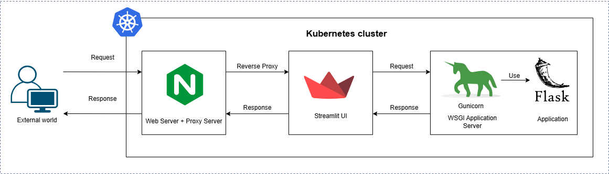

# ML Streamlit Nginx Flask Kubernetes

A comprehensive machine learning application deployed using Kubernetes, featuring a Flask API, Streamlit UI, and Nginx server. The project leverages Docker, Kubernetes, and Minikube to deploy a scalable and modular machine learning pipeline.

## 🧩 Architecture



### Architectural Overview

The architecture is designed to create a robust, scalable, and modular system tailored for modern web applications, especially those serving machine learning models. This approach emphasizes flexibility, security, and performance, ensuring that the system can efficiently handle the demands of real-world use.

At the core of this architecture is the Flask API, hosted on Gunicorn. Flask, known for its lightweight and flexible nature, is an ideal choice for serving machine learning models. Gunicorn complements Flask by acting as a Python WSGI HTTP server that can manage multiple incoming requests simultaneously, ensuring that the API remains responsive even under significant load. This combination is not only scalable, allowing for horizontal expansion by adding more worker processes but also reliable, ensuring the application remains stable and maintainable over time.

The architecture also includes a Streamlit UI, which provides an interactive interface for visualizing and interacting with data. Streamlit's simplicity and focus on real-time interaction make it an excellent choice for applications that require users to engage with data insights directly. This enhances user engagement and makes data more accessible, allowing for rapid development and iteration of visualization components.

To manage incoming traffic and secure communications, Nginx is employed as a reverse proxy. Nginx routes traffic to the appropriate services—whether it's the Flask API or the Streamlit UI—while also handling SSL termination. This setup ensures that all client-server communications are encrypted, safeguarding sensitive data. Additionally, Nginx's capability to balance the load across multiple backend instances improves the overall system performance, ensuring that it can handle high volumes of traffic efficiently.

Containerization with Docker plays a crucial role in this architecture by encapsulating the Flask API, Streamlit UI, and Nginx server into distinct containers. This approach ensures consistency across different environments—whether it's development, testing, or production. Docker's ability to encapsulate all dependencies within a container makes the application portable and easy to deploy across various systems. Moreover, running each service in its own container isolates them from one another, preventing conflicts and making it easier to manage and scale individual components as needed.

Orchestration is handled by Kubernetes, which manages the deployment and scaling of Docker containers. Kubernetes brings scalability, self-healing, and automated rollouts to the architecture, allowing the system to scale up or down based on demand. This ensures that resources are utilized efficiently, and the system remains resilient by automatically replacing failed containers, thereby reducing downtime and maintaining system availability.

This architecture is designed not only to meet the demands of a production-grade machine learning application but also to provide strategic benefits such as modularity, scalability, and security. By separating the application into distinct components—API, UI, and proxy—each can be developed, tested, and deployed independently, increasing flexibility and simplifying system management. The architecture's scalability ensures that both the Flask API and Streamlit UI can independently handle increased demand, while the use of Nginx for SSL termination enhances security. Lastly, the combination of Docker and Kubernetes streamlines the deployment process, enabling continuous integration and delivery, which facilitates quick and risk-free updates.

Overall, this architecture balances performance, security, and ease of maintenance, laying a strong foundation for future growth and ensuring the system can meet the evolving needs of its users.

## 📁 Project Structure

```bash
ml-streamlit-nginx-flask-kubernetes/
├── 📁 architecture
│   └── k8s-arch.drawio.png
├── 📁 flask_app
│   ├── app.py
│   ├── iris_model.pkl
│   └── requirements.txt
├── 📁 k8s
│   ├── flask-api-deployment.yaml
│   ├── flask-api-service.yaml
│   ├── nginx-server-deployment.yaml
│   ├── nginx-server-service.yaml
│   ├── streamlit-ui-deployment.yaml
│   └── streamlit-ui-service.yaml
├── 📁 model_training
│   ├── data_loader.py
│   ├── model.py
│   ├── train.py
│   └── utils.py
├── 📁 nginx
│   ├── 📁 certs
│   │   ├── nginx-selfsigned.crt
│   │   └── nginx-selfsigned.key
│   └── nginx.conf
├── 📁 streamlit_app
│   ├── requirements.txt
│   └── streamlit_app.py
├── .gitignore
├── docker-compose.yaml
├── Dockerfile.flask-api
├── Dockerfile.nginx-server
├── Dockerfile.streamlit-ui
├── LICENSE
├── minikube-deployment.bat
└── README.md
```

## 🚀 Features

- **Model Training**: Python scripts for data loading, model training, and utility functions.
- **Flask API**: REST API serving machine learning predictions.
- **Gunicorn**: WSGI server for Flask API.
- **Streamlit UI**: Interactive user interface to visualize model predictions.
- **Nginx Server**: Reverse proxy and SSL termination.
- **Kubernetes**: Deployment and service configurations for scalable and modular architecture.

## 🛠️ Installation

1. **Clone the repository:**

    ```bash
    git clone https://github.com/CodeRabbitHub/ml-streamlit-nginx-flask-kubernetes.git
    cd ml-streamlit-nginx-flask-kubernetes
    ```

2. **Install Dependencies:**

   - Flask Application:
     ```bash
     cd flask_app
     pip install -r requirements.txt
     ```
   - Streamlit Application:
     ```bash
     cd streamlit_app
     pip install -r requirements.txt
     ```

3. **Set up Docker:**
    ```bash
    docker-compose up --build
    ```

4. **Deploy on Kubernetes:**
    - Start Minikube:
      ```bash
      minikube start
      ```
    - Deploy using the batch script:
      ```bash
      ./minikube-deployment.bat
      ```

## 🎯 Usage

- **Access the Flask API:**
  - URL: `http://localhost:5000/`
- **Access the Streamlit UI:**
  - URL: `http://localhost:8501/`
- **Nginx Server:**
  - URL: `https://localhost/`


## Detailed Overview

This section provides a comprehensive breakdown of the key components of the project, including model training, Flask application, Nginx configuration, and SSL certificate generation. Each part has been meticulously designed to ensure robustness, scalability, and security.

---

## 🧠 Model Training and Artifact Management

The Iris classification model leverages the XGBoost algorithm, known for its efficiency and accuracy in handling structured data. The model is encapsulated within the `IrisModel` class, which manages training, evaluation, and prediction tasks. Post-training, the model is serialized into an artifact, facilitating seamless integration into the Flask application.

### Model Training

The `IrisModel` class is tailored for classifying Iris species using an XGBoost classifier. The class is equipped with customizable hyperparameters, enabling fine-tuning of the model’s performance to suit various use cases.

#### Key Components

- **Initialization:**
    ```python
    def __init__(self, n_estimators=100, max_depth=4, learning_rate=0.1, subsample=0.8, colsample_bytree=0.8, random_state=42):
    ```
    The model initialization involves setting essential hyperparameters, such as the number of boosting rounds, maximum tree depth, learning rate, and sampling ratios. A random seed is also provided to ensure reproducibility, which is critical for consistent model performance across different runs.

- **Training:**
    ```python
    def train(self, x_train, y_train):
    ```
    The `train` method employs the XGBoost model to learn patterns from the provided training data (`x_train`, `y_train`). It utilizes parallel processing capabilities to expedite the training process, ensuring efficient use of computational resources.

- **Evaluation:**
    ```python
    def evaluate(self, x_test, y_test):
    ```
    The `evaluate` method measures the model's accuracy on a test dataset, offering insights into its ability to generalize to new, unseen data. This step is crucial for validating the model's effectiveness before deployment.

- **Prediction:**
    ```python
    def predict(self, x):
    ```
    The `predict` method generates predictions based on new input data, enabling real-time classification tasks within the Flask application.

### Saving the Model Artifact

Upon successful training and evaluation, the model is serialized into a file using Python’s `pickle` module. This serialized artifact (`iris_model.pkl`) ensures that the model can be easily loaded and deployed without retraining, promoting efficiency and resource conservation.

#### Saving the Model
```python
import pickle

# Train the model
iris_model = IrisModel()
iris_model.train(x_train, y_train)

# Save the trained model to a file
with open("iris_model.pkl", "wb") as file:
    pickle.dump(iris_model, file)
```

- **`pickle.dump(iris_model, file)`**: This command serializes the `IrisModel` instance and stores it in the `iris_model.pkl` file. By doing so, the model can be transported and reused across different environments, streamlining the deployment process.

### Loading the Model in Flask

In the Flask application, the saved model artifact is loaded using `pickle`, making it available for prediction tasks. This approach guarantees consistency, as the exact model used during training is deployed in production.

```python
with open("iris_model.pkl", "rb") as file:
    model = pickle.load(file)
```

### Benefits of Model Serialization

- **Portability:** Serialized models can be easily shared and deployed across different platforms, enhancing the flexibility of your ML pipeline.
- **Consistency:** Ensuring that the deployed model is identical to the trained one mitigates risks of discrepancies in predictions.
- **Reusability:** Reusing the trained model eliminates the need for retraining, saving time and computational resources.

By adopting this model artifact management strategy, the project ensures that the trained model integrates seamlessly into the broader application infrastructure, offering accurate and efficient predictions.

---

## 🚀 Flask Application

The Flask application (`app.py`) acts as the backend API for predicting Iris species based on user-provided features. It loads a pre-trained machine learning model and exposes an endpoint to handle prediction requests.

### Key Components

- **Loading the Model:**
    ```python
    with open("iris_model.pkl", "rb") as file:
        model = pickle.load(file)
    ```
    The application loads the pre-trained model from `iris_model.pkl`, which serves as the engine for generating predictions based on input features.

- **Prediction Endpoint:**
    ```python
    @app.route("/predict", methods=["POST"])
    def predict():
    ```
    The `/predict` endpoint handles POST requests containing a JSON payload with the Iris flower’s features. It processes the input data and returns the predicted class.

- **Input Validation:**
    ```python
    def validate_input(data):
    ```
    The `validate_input` function ensures the incoming data is structured correctly and contains valid numerical values, preventing errors during prediction.

- **Class Name Mapping:**
    ```python
    def get_class_name(class_idx):
    ```
    This function maps the model’s predicted class index to a human-readable class name, making the API response more understandable.

### How It Works

1. **Receive Request:** The API accepts a POST request at the `/predict` endpoint with a JSON payload containing the Iris flower’s features.
2. **Validate Input:** The input data is validated to ensure it meets the expected format and contains valid numerical values.
3. **Make Prediction:** The model processes the validated features and predicts the class of the flower.
4. **Return Response:** The API returns a JSON response that includes the predicted class index and its corresponding name.

### Hosting with Gunicorn

Gunicorn is used to deploy the Flask application in a production environment, handling multiple requests efficiently and ensuring scalability.

#### Command to Run the Application with Gunicorn

```bash
gunicorn --bind 0.0.0.0:5000 app:app
```

- **`--bind 0.0.0.0:5000`**: This binds Gunicorn to all available IP addresses on port 5000, making the API accessible across the network.
- **`app:app`**: This specifies the Flask application to be served, with `app` being the instance of the Flask class.

By hosting the Flask application with Gunicorn, the project ensures that it can handle multiple client requests concurrently, providing reliable and fast predictions in a production environment.

---

## 🛠️ Nginx Configuration File

The Nginx configuration file (`nginx.conf`) plays a pivotal role in routing HTTP and HTTPS traffic, proxying requests to the appropriate services, and supporting WebSocket connections within the Kubernetes deployment.

### Configuration Overview

The Nginx configuration is split into key server blocks:

1. **HTTP to HTTPS Redirection:**
    ```nginx
    server {
        listen 80;
        server_name localhost;

        return 301 https://$host$request_uri;
    }
    ```
    - **Port 80 Listening:** Nginx listens for HTTP traffic on port 80.
    - **Redirection:** Automatically redirects all HTTP traffic to HTTPS, ensuring all communications are encrypted and secure.

2. **Main HTTPS Server Block:**
    ```nginx
    server {
        listen 443 ssl;
        server_name localhost;

        ssl_certificate /etc/ssl/certs/nginx-selfsigned.crt;
        ssl_certificate_key /etc/ssl/certs/nginx-selfsigned.key;
    ```
    - **Port 443 Listening:** Listens for HTTPS traffic, ensuring secure communication.
    - **SSL Configuration:** Uses a self-signed SSL certificate and key to encrypt traffic, safeguarding data transmitted between clients and the server.

3. **Proxying Requests to Streamlit:**
    ```nginx
    location / {
        proxy_pass http://streamlit-ui:8501;
        proxy_set_header Host $host;
        proxy_set_header X-Real-IP $remote_addr;
        proxy_set_header X-Forwarded-For $proxy_add_x_forwarded_for;
        proxy_set_header X-Forwarded-Proto $scheme;
    }
    ```
    - **Proxy Pass:** Routes requests to the Streamlit service, allowing the UI to be served alongside the Flask API.
    - **Header Management:** Preserves critical request headers, maintaining the integrity and traceability of requests.

4. **WebSocket Support:**
    ```nginx
    location /stream {
        proxy_pass http://streamlit-ui:8501/stream;
        proxy_http_version 1.1;
        proxy_set_header Upgrade $http_upgrade;
        proxy_set_header Connection "upgrade";
        proxy_read_timeout 86400;
        proxy_send_timeout 86400;
    }
    ```
    - **WebSocket Handling:** Ensures that real-time connections, such as those required for WebSockets, are properly supported, enabling dynamic interactions.

5. **Logging:**
    ```nginx
    access_log /var/log/nginx/access.log;
    error_log /var/log/nginx/error.log;
    ```
    - **Access Log:** Records details of incoming requests for monitoring and analysis.
    - **Error Log:** Captures errors encountered during request processing, aiding in debugging.

### Purpose

This Nginx configuration ensures secure communication via HTTPS, efficient routing of requests to the Streamlit service, and proper handling of WebSocket connections. The logging capabilities allow for ongoing monitoring and troubleshooting, ensuring a reliable and secure deployment.

---

## 🔐 Generating SSL Certificates

Securing the Nginx server involves generating SSL certificates, which encrypt data and protect it from unauthorized access.

### Generate SSL Certificates with OpenSSL

Use OpenSSL to generate the SSL certificate (`nginx-selfsigned.crt`) and private key (`nginx-selfsigned.key`):

```bash
openssl req -x509 -nodes -days 365 -newkey rsa

:2048 -keyout nginx-selfsigned.key -out nginx-selfsigned.crt
```

- **`-x509`**: Creates a self-signed certificate.
- **`-nodes`**: Specifies that no passphrase is required for the key.
- **`-days 365`**: The certificate is valid for 365 days.
- **`-newkey rsa:2048`**: Generates a new RSA key with a 2048-bit length.

### SSL Certificates Directory

The generated SSL certificate and key are stored in the `/etc/ssl/certs/` directory, and Nginx is configured to use these files for encrypting communications:

```nginx
ssl_certificate /etc/ssl/certs/nginx-selfsigned.crt;
ssl_certificate_key /etc/ssl/certs/nginx-selfsigned.key;
```

By following this process, the project ensures that all client-server communications are encrypted, enhancing security and protecting sensitive data.

---

### Streamlining Kubernetes Deployment with Minikube

Minikube is leveraged to create a local Kubernetes cluster, enabling the testing and development of the application in an environment that closely mimics production. The Kubernetes manifests define the deployment of the Flask API, Streamlit UI, and Nginx server, ensuring a seamless and scalable deployment process.

---

This documentation provides a detailed breakdown of the project’s components, highlighting how each part contributes to a robust, scalable, and secure deployment. This structured approach ensures that the application can be effectively maintained and scaled, meeting both current and future requirements.


## 📝 License

This project is licensed under the MIT License. See the [LICENSE](LICENSE) file for details.


## 🤝 Contributing

Contributions are welcome! Please feel free to submit a Pull Request.

